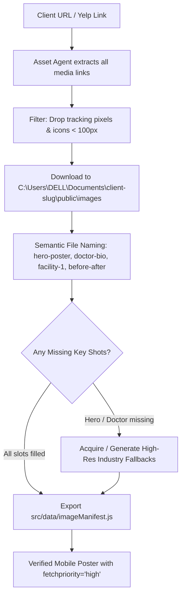

# 📸 Asset Harvester Agent: Media Intake & Optimization

The Asset Harvester Agent (`asset-agent`) automates media acquisition so that **every scaffolded website launches with rich, authentic imagery** directly in `public/images/`.

---

## 🎯 Core Mission & Workflow

Whenever a business link (website, Yelp, social listing) is provided:



---

## 🛠️ Step-by-Step Execution Protocol

### 1. Image Discovery & Filtering
- Scrapes ``, `<picture>`, `srcset`, and CSS `background-image` URLs from the client's existing site or Yelp gallery.
- Categories captured:
  - **Hero & Identity**: Main header images, logo, favicon.
  - **Leadership & Team**: Headshots of doctors, master mechanics, founders, staff.
  - **Facility & Office**: Treatment rooms, waiting areas, service bays, exterior storefronts.
  - **Work & Transformations**: Before & after smiles, dental crowns, engine rebuilds, restorations.
  - **Trust & Badges**: Accreditation logos (ADA, ASE, BBB, CareCredit).
- Discard SVGs with low resolution, social share icons, and tracker pixels.

### 2. Download Pipeline (PowerShell / Node)
- Downloads images directly into:
  `C:\Users\DELL\Documents\<client-slug>\public\images\`
- Normalizes files into standard formats (`.jpg`, `.webp`, `.png`) with clean, predictable filenames:
  - `hero-poster.jpg`
  - `doctor-profile.jpg` / `owner.jpg`
  - `facility-1.jpg`, `facility-2.jpg`
  - `service-1.jpg`, `service-2.jpg`, `service-3.jpg`
  - `before-1.jpg`, `after-1.jpg`

### 3. Image Manifest Export (`src/data/imageManifest.js`)
Generates a decoupled manifest so components consume local static assets without hardcoding:

```javascript
export const imageManifest = {
  hero: {
    poster: '/images/hero-poster.jpg',
    alt: 'Professional care and advanced facility'
  },
  leadership: {
    primary: '/images/doctor-profile.jpg',
    alt: 'Practice founder and head practitioner'
  },
  facility: [
    '/images/facility-1.jpg',
    '/images/facility-2.jpg'
  ],
  services: [
    '/images/service-1.jpg',
    '/images/service-2.jpg',
    '/images/service-3.jpg'
  ],
  transformations: [
    { before: '/images/before-1.jpg', after: '/images/after-1.jpg' }
  ]
};
```

### 4. Zero-Empty-Card Guarantee
- If the source site is missing high-res imagery for the hero or key procedures, the agent automatically supplies industry-calibrated, high-converting imagery (e.g. realistic dental procedures, modern luxury clinic interiors, or master diagnostic bays) so **no card or hero section is ever blank or generic**.

---

## ✅ Quality Checklist
- [ ] Every image saved locally under `public/images/` (no fragile external hotlinks).
- [ ] `hero-poster.jpg` exists with high contrast and `fetchpriority="high"` tag for instant mobile load.
- [ ] No image files exceeding 800KB (optimizes load time and mobile bandwidth).
- [ ] Semantic alt text generated for all images for 2026 AI-native accessibility.
