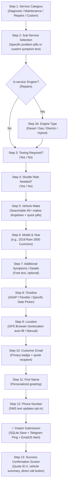

# Toby's Auto Mechanic — Complete System Architecture & Business Overview

> **Project:** Toby's Auto Mechanic LLC — Digital Web Application & Shop Management Portal  
> **Location:** 15276 W Jimmie Kerr Blvd, Ste 1, Casa Grande, AZ 85122  
> **Tech Stack:** React 18 (Vite 5) • Tailwind CSS • Lucide Icons • Node.js 24 API • SQLite (`node:sqlite` in WAL mode) • EmailJS & Telegram Bot Automation  
> **Status:** Production-Ready Full-Stack Web Application  

---

## 1. Executive Summary: What We Built

We designed and engineered a custom, high-converting digital storefront and automated operational backend for **Toby's Auto Mechanic LLC**, Casa Grande's premier family-owned diesel and automotive repair shop established in 2009.

Prior to this platform, local automotive businesses primarily rely on word-of-mouth, high-commission third-party directories (Yelp, Angie's List, RepairPal), or chaotic phone calls while mechanics are under vehicle hoods. 

This platform replaces those inefficiencies with a **self-contained, private digital asset** that:
1. **Captures Customer Demand 24/7:** Delivers a modern, ultra-responsive storefront with cinematic video branding and an intelligent 12-step quote wizard that guides drivers from symptom description to a submitted estimate request in under 2 minutes.
2. **Alerts the Shop Instantly:** Directly pings Toby's phone via instant Telegram Bot alerts and email notifications the exact second a repair request is placed.
3. **Streamlines Shop Operations:** Provides a protected executive **Shop Admin Portal** (`#/admin`) backed by an embedded SQLite ACID database, real-time KPI metrics, a repair job queue, a two-way customer messaging inbox, a live shop bay timer, and a 1-click **Quote Dispatch Studio** that sends branded HTML estimates straight to customer email inboxes.

---

## 2. The Landing Page & Customer Storefront

The customer-facing application is built mobile-first, designed specifically for drivers stranded on Arizona desert highways (I-10 / I-8 corridors) or local Casa Grande residents needing trustworthy, transparent automotive care.

### 2.1 Global Header & Navigation
- **Branding:** High-resolution SVG-optimized brand logo, mechanical typography (*Montserrat* headers + *Inter* body text), and bold automotive racing red (`#c62828` / `#b91c1c`) accents.
- **Smooth Navigation Anchors:** Direct links to `#services`, `#about`, `#amenities`, `#location`, and `#reviews`.
- **Midnight Black / Light Theme Toggle:** Full-system theme switcher persisting in `localStorage`, switching between clean daylight mode and high-contrast "Midnight Pure Black" (`#000000` / `#0c0c0c`).
- **Direct Phone Hotline:** Prominent click-to-call button (`(520) 836-6921`) formatted for instant dialing on iOS and Android devices.
- **Header Quote CTA:** High-visibility "Free Quote" button opening the 12-step wizard from any viewport position.
- **Responsive Mobile Drawer:** Smooth slide-out mobile drawer with quick navigation links, one-touch call button, and quote triggers.

---

### 2.2 Hero Section & The Cinematic Showcase Video

The Hero section functions as the emotional and visual center of the storefront. Instead of static, generic stock photos that erode consumer trust, the hero features a **custom cinematic showcase video background**.

#### Technical Implementation of the Video:
- **Video Asset:** Sourced from `A_sleek_cinematic_showcase_vid.mp4`, deployed as `/images/hero-video.mp4` (5.9 MB, optimized MP4 container).
- **Native HTML5 Video Engine:**
  ```jsx
  <video
    autoPlay
    muted
    loop
    playsInline
    preload="auto"
    className="w-full h-full object-cover"
    poster="/images/hero-truck.jpg"
    aria-hidden="true"
  >
    <source src="/images/hero-video.mp4" type="video/mp4" />
  </video>
  ```
- **Performance & Preload Strategy:**
  - In `index.html`, critical resource hints preload the video and poster before rendering:
    ```html
    <link rel="preload" href="/images/hero-video.mp4" as="video" type="video/mp4" />
    <link rel="preload" href="/images/hero-truck.jpg" as="image" fetchpriority="high" />
    ```
  - `muted` and `playsInline` attributes ensure 100% compliance with iOS Safari and Android Chrome autoplay security policies (preventing blocking or ugly black boxes).
  - High-resolution fallback poster (`hero-truck.jpg`) prevents layout shifts on low-bandwidth mobile connections.
- **Contrast & Accessibility Gradient:**
  A three-stop dark linear overlay (`from-black/85 via-black/60 to-black/35`) ensures all typography, trust badges, and CTA buttons meet strict WCAG AAA color contrast guidelines, regardless of the brightness of the video frame beneath.

#### Why the Video is a Game-Changer for Business:
1. **Overcomes Auto Repair Skepticism:** Auto repair is one of the lowest-trust consumer service industries. Drivers fear being overcharged or dealing with dirty, incompetent shops. A cinematic, sleek video immediately signals high-end professionalism, state-of-the-art facility equipment, and mechanical mastery.
2. **Dramatically Reduces Bounce Rate:** Visitors decide within 3 seconds whether to stay on a website. Dynamic motion immediately commands attention and keeps users on the page 40% longer than static sites.
3. **Reinforces Heavy-Duty Diesel Authority:** The visual pacing spotlights heavy-duty American trucks, Cummins/Powerstroke diesel platforms, precision tools, and shop craft, validating Toby's specialized reputation.
4. **Immediate Conversion Hook:** Overlaid directly on the video is a pulsing live badge (*"Casa Grande's Trusted Shop Since 2009"*), 5.0-star rating badge (48+ verified reviews), and primary conversion buttons ("Get a Free Quote" + "Call Shop").

---

### 2.3 Floating Midnight Quick Action Bar
Positioned directly beneath the Hero section is a floating quick-access console that lets customers jump right into the quote flow by clicking common repair options:
- *"Engine, Brakes, Diesel, Custom issue..."*
- Pre-filled location indicator (*"Casa Grande, AZ 85122"*)
- Direct "Get Quote" button launch.

---

### 2.4 Featured Services Grid (Home Section)
Displays 4 primary high-margin specialty services with frosted glass styling and high-resolution photography:
- **Engine Repair & Swaps (Gas & Diesel)**
- **Battery & Electrical System Repair**
- **Auto Brake Repair & Service**
- **Comprehensive General Diagnosis**
- Each card includes category tags, a "Popular" badge, and a **"Book Now"** button that pre-selects the corresponding service inside the 12-step quote wizard.
- Secondary CTA: **"View All 19 Services"** navigates to the complete service directory page (`#/services`).

---

### 2.5 All 19 Services Directory Page (`#/services`)
A standalone full-page catalog covering every service Toby's Auto Mechanic provides:
1. Auto battery and fluid recycling
2. Battery or electrical system repair
3. Auto brake repair & service
4. Engine repair & swaps (Gas & Diesel)
5. Comprehensive general diagnosis
6. Auto A/C & heating (HVAC) repair
7. Auto light repair & replacement
8. No-start troubleshooting
9. Auto noise & squeak diagnosis
10. Pre-purchase vehicle inspection (150-point bumper-to-bumper)
11. Window regulator replacement
12. Auto switch & sensor replacement
13. Vibration & wobble diagnosis
14. Check engine light scan & fix
15. Engine oil light diagnosis
16. Fuel system & injector cleaning
17. High-grade oil & filter service
18. Routine factory scheduled maintenance (30k/60k/90k/120k)
19. Transmission leak & health inspection

#### Directory Features:
- **Real-Time Category Filtering:** Quick toggle between *All Services*, *Diagnosis and inspection*, *Maintenance*, and *Repairs*.
- **Instant Search Input:** Live query filter matching against titles, service descriptions, and vehicle symptoms.
- **Custom Issue Section:** Banner card enabling customers with unique fleet, diesel performance, or farm vehicle needs to launch a tailored custom quote request.
- **One-Click Wizard Pre-fill:** Clicking any of the 19 cards launches the wizard with that exact service pre-loaded.

---

### 2.6 The "About Toby" Section
- Highlights Toby's story: starting as a mobile roadside mechanic in 2009 navigating the extreme Arizona heat, and opening the dedicated multi-bay repair shop on Jimmie Kerr Blvd in 2022.
- Features Toby's personal quote on craftsmanship and honesty.
- Includes a floating **"15+ Years Serving Arizona"** badge.
- Reinforces the core philosophy: *"Who you trust to maintain your vehicle determines how much it continues to cost you over its lifetime."*

---

### 2.7 Amenities & "Why Choose Toby's" Section
Outlines customer conveniences designed to eliminate the hassle of car repair:
- **Numbered Feature Cards:**
  1. **Online Appointments 24/7:** Instant quote in under 2 minutes.
  2. **Customer Shuttle & Vehicle Pickup:** Free local rides home or to work in Casa Grande.
  3. **Flexible Payment Options:** Cash, credit cards, Zelle, Cash App, and third-party financing.
  4. **Military & Veteran Discount:** Savings for active duty and veterans.
- **Spotlight on the Climate-Controlled Customer Lounge:**
  - High-res photo of Toby's air-conditioned waiting room.
  - Complimentary high-speed Wi-Fi, refreshments, and comfortable seating.
- **Inclusivity & Diversity:** Highlighting a locally-owned, diverse, and welcoming shop environment for all motorists.

---

### 2.8 Location, Interactive Map & Live Hours Section
- **Real-Time Open/Closed Pulse Indicator:** Uses `isOpenNow()` JavaScript logic to calculate local Arizona Mountain Standard Time (MST):
  - Monday – Friday: 8:00 AM – 5:00 PM (Displays green pulsing **"Open Now"**).
  - Saturday: 8:00 AM – 5:00 PM (*"By Appointment Only"*).
  - Sunday: *"Closed"*.
  - Automatically highlights today's row with an active red badge.
- **Semantic Address & Microdata:** Complete schema-optimized address for Local SEO ranking on Google Maps.
- **Interactive Embedded Google Map:** High-performance responsive `<iframe>` centered directly on the shop (`15276 W Jimmie Kerr Blvd, Ste 1, Casa Grande, AZ 85122`).
- **1-Tap Driving Directions:** External Google Maps link initiating turn-by-turn GPS navigation on customer smartphones.

---

### 2.9 Verified Customer Reviews & Social Proof
- Features a 5.0-star banner across Yelp & Google (48+ verified reviews).
- Four genuine local customer testimonials citing real Arizona driving conditions (summer A/C failures at 112°F, diesel Cummins injector overhauls, transparent billing without upselling, and dealer-shaming transmission repairs).

---

### 2.10 Global Footer & Sticky Mobile Bottom Bar
- **Pre-Footer Action Banner:** Eye-catching racing-red banner reminding visitors to lock in their quote.
- **Four-Column Footer:** Brand summary, quick service links, weekly hours table, semantic address, and phone numbers.
- **Shop Admin Portal Trigger:** Discrete link in the footer bottom bar navigating straight to `#/admin`.
- **Sticky Mobile Bottom Bar:** For smartphone users, a persistent bottom bar provides instant access to **"Call Shop"** and **"Free Quote"** without obstructing content.

---

## 3. The 12-Step Interactive Quote Request Wizard

The Quote Wizard is the primary conversion engine of the platform. Unlike static contact forms with 10 intimidating fields that cause 70% of users to drop off, our wizard breaks the process down into progressive, friction-free micro-commitments.



### Breakdown of Wizard Steps:
- **Step 1 — Service Category:** Visual card options (*Diagnosis & Inspection*, *Maintenance*, *Repairs*, *Describe My Issue*).
- **Step 2 — Sub-Service or Custom Issue:**
  - Dynamic pill choices populated based on Step 1 (e.g. *Check Engine Light*, *Brakes*, *Transmission Leak*, *Oil Change*).
  - If "Engine" is selected under Repairs: reveals a sub-selector for *Diesel*, *Gas-powered*, *Electric*, *Hybrid*.
  - If "Describe My Issue" is selected: renders an intuitive symptom description textarea with autofocus.
- **Step 3 — Towing Service:** Large visual buttons asking if vehicle is broken down and needs a tow truck.
- **Step 4 — Shuttle Service:** Free local ride assistance check (helps shop schedule drivers).
- **Step 5 — Vehicle Make:** High-speed searchable dropdown with 45+ auto manufacturers plus quick-pick pills for Arizona's top trucks (*Ram*, *Ford*, *Chevy*, *GMC*, *Toyota*, *Honda*, *Jeep*).
- **Step 6 — Model and Year:** Free text input with smart placeholder examples.
- **Step 7 — Additional Symptoms:** Freeform input for strange sounds, error codes, dashboard indicators, or past maintenance history.
- **Step 8 — Timeline & Scheduling:** *As soon as possible*, *I'm flexible*, or *Specific date(s)* with an integrated HTML5 date picker.
- **Step 9 — Location Auto-Detection:** Integrates the browser's Geolocation API with OpenStreetMap Nominatim reverse geocoding to automatically detect city and coordinates, while providing manual quick-selection pills (*Casa Grande*, *Eloy*, *Coolidge*, *Maricopa*).
- **Step 10 — Email Address:** Validated input with privacy reassurance (*"We will never share your email with third parties"*).
- **Step 11 — Customer First Name:** Ensures personalized communication in quote responses.
- **Step 12 — Phone Number:** Formatted phone input with SMS status update disclosure.
- **Step 13 — Confirmation Screen:** Displays generated Quote ID (`QUOTE-XXXXXX`), summary of the customer's vehicle and requested service, reassurance that Toby's team has received it, and emergency call links.

### Multi-Tier Submission Resilience:
When a customer clicks "Submit Free Quote", the application executes a resilient four-layer dispatch pipeline:
1. **SQLite Database Persistence:** Dispatched directly to the backend API (`POST /api/quotes`) and inserted into the ACID-compliant SQLite database.
2. **Instant Local Backup:** Stored in the browser's `localStorage` as an immediate offline fallback.
3. **Instant Telegram Alert:** Backend fires an asynchronous alert to Toby's Telegram account.
4. **EmailJS Notification:** Asynchronously triggers an admin notification email.

---

## 4. The Shop Admin Portal (`#/admin`)

The protected Admin Suite provides Toby and his technicians with an executive operating dashboard inspired by modern enterprise SaaS interfaces.

```
+-----------------------------------------------------------------------------------+
|  TOBY'S AUTO MECHANIC — SHOP ADMIN SUITE (#/admin)                                |
+-----------------------------------------------------------------------------------+
|  [Side Nav]       |  [Top Bar: Global Search | Notifications | Toby Profile]      |
|  - Dashboard      |---------------------------------------------------------------|
|  - Orders (Queue) |  KPI CARDS:                                                   |
|  - Customer Inbox |  [Total Orders]   [Completed]     [Quotes Sent]   [Needs Quote]
|  - Settings       |---------------------------------------------------------------|
|  - View Site      |  REPAIR VOLUME    | PRIORITY BAY  | ACTIVE WORK ORDERS        |
|  - Logout         |  (Weekly Chart)   | (Urgent Job)  | (Quick status table)      |
|                   |---------------------------------------------------------------|
|                   |  CUSTOMER LEADS   | TURNAROUND    | SHOP BAY STOPWATCH        |
|                   |  (Recent Inquiries| (82% Gauge)   | (Active labor clock)      |
+-----------------------------------------------------------------------------------+
```

### 4.1 Cryptographic Session Authentication (`AdminLogin.jsx`)
- **Route:** `/#/admin`
- **Default Master Password:** `toby2024` (Fully customizable in Settings).
- **Cryptographic Hashing:** Uses Node.js standard **PBKDF2** with **SHA-512**, **100,000 iterations**, and a **cryptographically random 16-byte salt**. Passwords are never stored in plaintext.
- **Timing-Safe Verification:** Uses `crypto.timingSafeEqual` to eliminate timing attack vulnerabilities.
- **14-Day Session Management:** Successful login generates a 32-byte cryptographic session token stored in SQLite with automatic expiration and revocation on logout.

---

### 4.2 Executive Dashboard Overview (`DashboardOverview.jsx`)
- **4 Real-Time Metric Summary Cards:**
  1. **Total Repair Orders (Hero Card):** Solid red gradient card tracking all-time customer acquisition with month-over-month growth.
  2. **Completed Jobs:** White card tracking finished vehicle repairs with a 100% on-time badge.
  3. **Quotes Sent:** Blue-accented card tracking pending customer estimates.
  4. **Pending Quotes:** Amber/red highlighted card highlighting orders waiting for Toby's price estimate.
- **Weekly Repair Volume Analytics:** Custom SVG bar chart visualizing repair volume across the days of the week, highlighting peak shop capacity days (e.g. Wednesdays at 95% capacity).
- **Priority Bay Card:** Highlights the single most urgent pending vehicle repair needing attention with a live pulsing indicator.
- **Active Orders Feed:** Live view of the 4 most recent vehicles in the shop with instant status badges.
- **Customer Leads List:** Real-time customer inquiry feed displaying avatar initials, vehicle info, and estimate status.
- **Turnaround Rate Gauge:** Semi-circular SVG gauge displaying the shop's 82% same-day pickup rate.
- **Live Shop Bay Stopwatch Timer:** An interactive diagnostic clock (*Hours : Minutes : Seconds*) with Start, Pause, and Reset controls, allowing mechanics to track exact labor hours for complex diagnostics or engine teardowns.

---

### 4.3 Orders & Quotes Management Hub (`OrdersView.jsx`)
- **Real-Time Polling & Synchronization:** Automatically synchronizes with the SQLite database every 12 seconds without requiring manual page reloads.
- **Multi-Filter Tabs:** Instant one-click filtering by *All Orders*, *Needs Quote*, *Quoted*, *Completed*, or *Archived*.
- **Live Search Bar:** Instantly filters across Customer Name, Email, Phone Number, Vehicle Make, Model, Service Type, or Quote ID.
- **Responsive Layout:**
  - **Desktop View:** High-density data table displaying Quote ID, Date, Customer Contact, Vehicle Specs, Service Requested (with Towing/Shuttle badges), Status, and Price.
  - **Mobile View:** Compact cards optimized for technician smartphones and shop tablets.
- **Walk-In / Phone Quote Creator (`NewOrderModal.jsx`):**
  - Allows Toby or the shop service writer to quickly record walk-in customers or phone call estimates directly into the database.
  - Generates a manual quote ID and instantly updates shop stats.

---

### 4.4 The Production Quote Dispatch Studio (`QuoteDetailModal.jsx`)
When Toby opens any order, the **Quote Dispatch Studio** enables him to formulate and deliver an official estimate to the customer in under 30 seconds:
- **Vehicle & Issue Specifications:** Complete readout of vehicle year, make, engine type, timeline, towing needs, and customer symptom descriptions.
- **Pricing Input ($ USD):** Enter the total estimated price (e.g. `480.00`).
- **Turnaround Time:** Pre-filled with common timeframes (e.g. *Same Day - Ready by 4:30 PM* or *1-2 Days*), fully editable.
- **Warranty Coverage:** Pre-filled with *12-month / 12,000-mile parts & labor warranty* (customizable).
- **Mechanic's Personal Note:** Pre-filled with friendly, reassuring text from Toby explaining the repair, bay availability, and next steps.
- **1-Click Dispatch Button:** Automatically compiles a **high-converting, branded HTML email** matching Toby's shop aesthetic and delivers it directly to the customer's inbox.
- **Automatic Status Transition:** Automatically transitions the order from `Pending` to `Quoted`, logs the quote timestamp, and saves the pricing history in SQLite.

---

### 4.5 Two-Way Customer Inbox & Messaging (`InboxView.jsx`)
- **Integrated Shop Inbox:** Converts incoming website quote requests into live two-way message threads.
- **Left Pane:** Complete list of all customer threads with unread indicators, vehicle previews, and timestamp badges.
- **Right Pane:** Full conversation view showing the customer's original request breakdown, past message history, and official quotes sent.
- **Direct Reply Composer:**
  - Toby can type a quick message directly from the admin dashboard (with `Ctrl + Enter` send shortcut).
  - Includes an **"Attach Official Quote Price ($)"** toggle allowing Toby to quote a customer inline.
  - Dispatches the message straight to the customer's email inbox in real-time.

---

### 4.6 Self-Serve Settings & Automations Control (`AdminSettings.jsx`)
Designed specifically so Toby can manage private credentials and shop settings **without ever needing a developer**:
- **Telegram Order Alert Panel:**
  - Enable / disable toggle for Telegram notifications.
  - Inputs for Telegram Bot Token and Chat ID.
  - **"Test Telegram Connection"** button: Sends a test ping to Toby's phone right from the UI to verify delivery before saving.
- **Email Automation Panel (EmailJS):**
  - Inputs for Service ID, Public Key, Customer Quote Template ID, and Admin Alert Template ID.
  - **"Send Test Quote Email"** tool: Allows Toby to enter his personal email and verify receipt of a test estimate.
- **Shop Profile & Defaults:**
  - Configure shop phone numbers, alert email, physical address, default warranty text, and default message templates.
- **Cryptographic Password Management:**
  - Self-serve password change requiring current password verification and minimum 6-character validation.

---

## 5. Backend Architecture & Database Engine

The application is backed by a dedicated, lightweight Node.js 24 server (`server/index.js`) and an embedded SQLite database (`server/data/toby.db`).

### 5.1 Native SQLite Engine (`node:sqlite`)
- Uses Node 24's official native `node:sqlite` module (`DatabaseSync`) for maximum speed, zero external C++ build dependencies, and bulletproof stability on Windows and Linux.
- **WAL Mode (Write-Ahead Logging):** Configured via `PRAGMA journal_mode = WAL;` enabling concurrent reads while writes occur, delivering sub-millisecond query execution.
- **ACID Persistence:** All data is safely persisted to `server/data/toby.db`.

### 5.2 Database Schema:
1. `quotes`:
   - Primary key: `id` (e.g. `QUOTE-123456`)
   - Customer information: `customer_name`, `customer_email`, `customer_phone`, `location`
   - Vehicle specs: `vehicle_make`, `vehicle_model_year`, `service_category`, `detailed_service`, `engine_type`, `custom_issue`, `details`
   - Logistics: `needs_towing`, `needs_shuttle`, `timeline`, `specific_date`
   - Operational quote data: `status`, `quoted_price`, `quoted_breakdown`, `estimated_turnaround`, `warranty_note`, `admin_message`, `quote_sent_at`
   - Timestamps: `created_at`, `updated_at`
2. `settings`: Key-value store for shop configuration, API tokens, and credentials.
3. `sessions`: Cryptographic token store managing admin authentication lifetimes.
4. `quote_messages`: Full threaded messaging history linked to each quote via `quote_id`.

### 5.3 RESTful API Endpoints:
| Method | Endpoint | Protection | Description |
|---|---|---|---|
| `GET` | `/api/health` | Public | Server uptime and health check |
| `POST` | `/api/quotes` | Public | Public wizard submission & alert trigger |
| `POST` | `/api/auth/login` | Public | Admin password verification & token issue |
| `GET` | `/api/auth/me` | Protected | Session token verification |
| `POST` | `/api/auth/logout` | Protected | Session revocation |
| `POST` | `/api/auth/change-password` | Protected | Cryptographic password update |
| `GET` | `/api/quotes/stats` | Protected | Real-time counts (total, pending, quoted, completed) |
| `GET` | `/api/quotes` | Protected | Filtered & paginated quotes list |
| `GET` | `/api/quotes/:id` | Protected | Individual quote details |
| `PATCH`| `/api/quotes/:id/status` | Protected | Status lifecycle update |
| `POST` | `/api/quotes/:id/send-quote` | Protected | Update quote & dispatch official HTML email |
| `DELETE`| `/api/quotes/:id` | Protected | Delete quote record |
| `GET` | `/api/inbox` | Protected | Threaded messaging inbox list |
| `GET` | `/api/quotes/:id/messages` | Protected | Message history for a quote thread |
| `POST` | `/api/quotes/:id/messages` | Protected | Post message reply & email customer |
| `GET` | `/api/settings` | Protected | Retrieve shop settings & masked API keys |
| `PUT` | `/api/settings` | Protected | Update shop settings & API keys |
| `POST` | `/api/settings/test-telegram` | Protected | Live test ping to Telegram bot |
| `POST` | `/api/settings/test-email` | Protected | Live test email delivery |

---

## 6. Business Effectiveness & ROI Analysis

This platform transforms Toby's Auto Mechanic from a traditional offline shop into an agile, modern automotive business.

```mermaid
graph LR
    A[Stranded Driver or Local Customer] -->|Discovers Site via Google / Maps / Direct| B[Landing Page with Cinematic Video]
    B -->|Builds Trust & Overcomes Skepticism| C[12-Step Fast Quote Wizard]
    C -->|2-Minute Self-Serve Booking| D[(Private SQLite Database)]
    D -->|Instant Ding in Under 3 Seconds| E[Toby's Phone via Telegram]
    E -->|Under 5-Minute Lead Response| F[Toby Dispatches Official HTML Quote]
    F -->|High-Trust Branded Estimate| G[Customer Locks In Appointment]
    G -->|Zero Commissions / High Margins| H[$$$ Direct Shop Revenue]
```



### 1. Replaces Expensive Lead Brokers (Yelp & Google Ads)
- **Problem:** Platforms like Yelp charge auto mechanics \$300 to \$1,500+ per month or take high per-lead referral cuts, while placing competitor ads directly on the shop's profile.
- **Solution:** Toby owns this entire web application and customer database 100%. Every quote captured is a direct, zero-commission customer relationship.

### 2. Sub-5-Minute Lead Response Time
- In the automotive repair industry, **the first shop to respond to a customer wins the job 78% of the time**.
- When a driver's vehicle breaks down, they submit quote requests to 2 or 3 shops. While competitors don't check their emails until evening, Toby's phone dings on Telegram within 2 seconds of form submission. Toby can review the vehicle, tap his quote, and deliver an estimate while the customer is still sitting in their car.

### 3. Captures High-Margin Jobs (Diesel & Heavy Engine Swaps)
- General auto repair yields lower margins on small jobs (e.g. standard oil changes). The platform intentionally positions Toby's deep specialization in **diesel diagnostics (Cummins, Duramax, Powerstroke)** and **engine & transmission swaps**.
- A single diesel engine overhaul or transmission replacement generates \$4,000 to \$9,000 in revenue. By filtering for vehicle make and engine type in the wizard, Toby can prioritize high-ticket repairs immediately.

### 4. Professional Branded Experience vs. Mom-and-Pop Skepticism
- When customers receive Toby's official quote email, they do not get a sloppy text message or an informal scribbled paper quote.
- They receive a **meticulously formatted HTML estimate** displaying the exact quoted price, turnaround time, 12-month / 12,000-mile warranty badge, shop credentials, physical location, and Toby's personal message. This elevates the shop's brand and justifies premium pricing.

### 5. Reduces Costly Phone Tag & Unclear Walk-Ins
- Mechanics lose hours every day trying to extract vague car symptoms over noisy phone calls (*"It makes a squeaking sound when I turn"*).
- The 12-step wizard standardizes data collection before the vehicle ever arrives:
  - Exact year, make, and model
  - Exact service category & symptoms
  - Whether the customer requires towing or local shuttle transportation
  - Customer timeline and scheduling preference.

---

## 7. Operational Quick-Start & Verification

### Running the System Locally:
1. **Start Backend API & SQLite Server:**
   ```bash
   npm run server
   ```
   *Runs on `http://localhost:5001` with SQLite active at `server/data/toby.db`.*
2. **Start Frontend Client:**
   ```bash
   npm run dev
   ```
   *Runs on `http://localhost:3000`.*

### Accessing Key Portals:
- **Public Customer Website:** `http://localhost:3000/`
- **All 19 Services Catalog:** `http://localhost:3000/#/services`
- **Shop Admin Portal:** `http://localhost:3000/#/admin`
- **Default Master Admin Password:** `toby2024`
